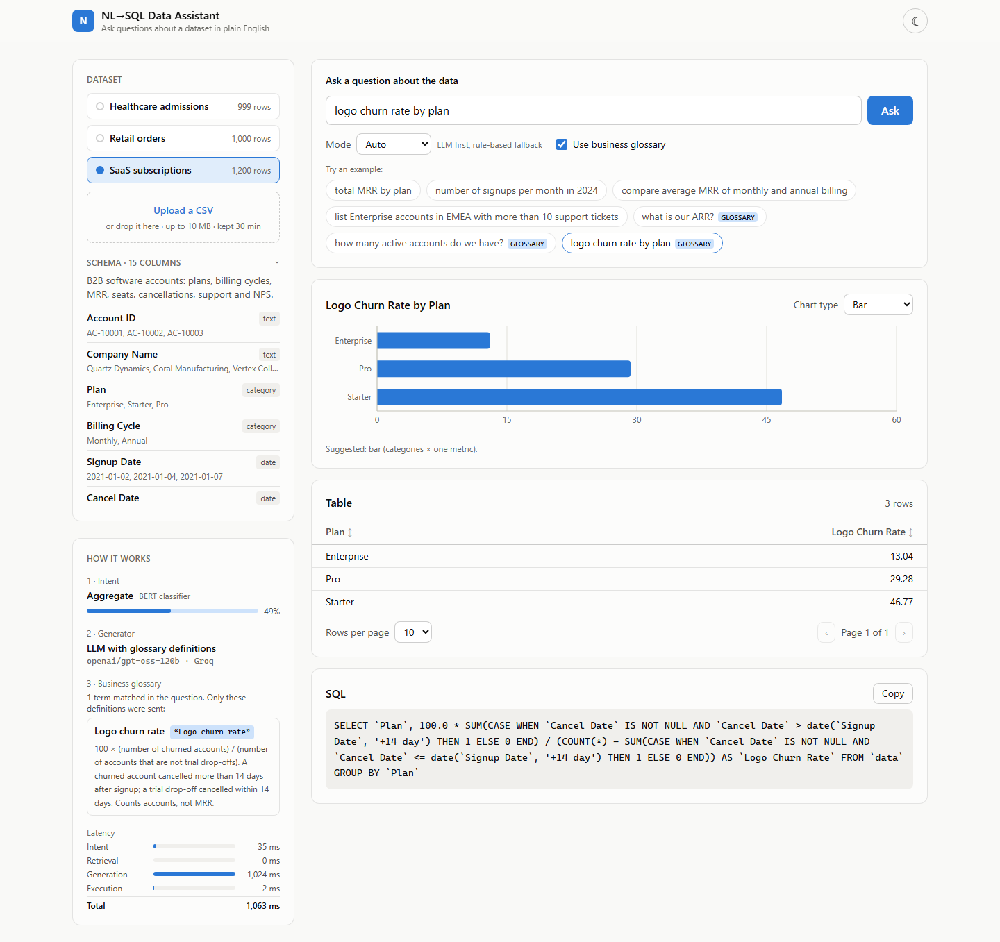
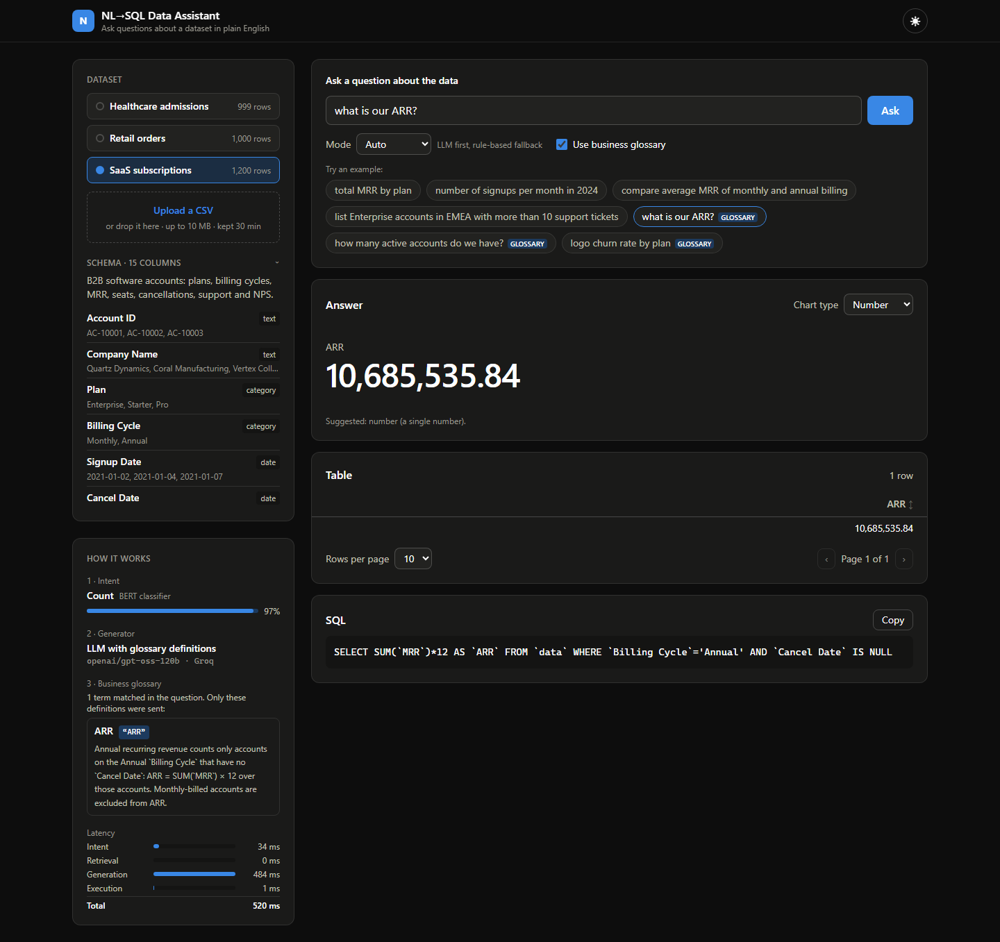
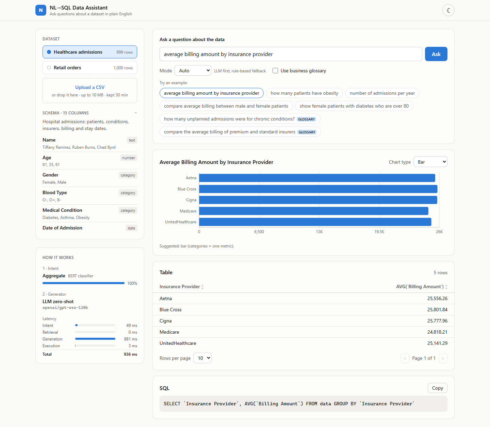
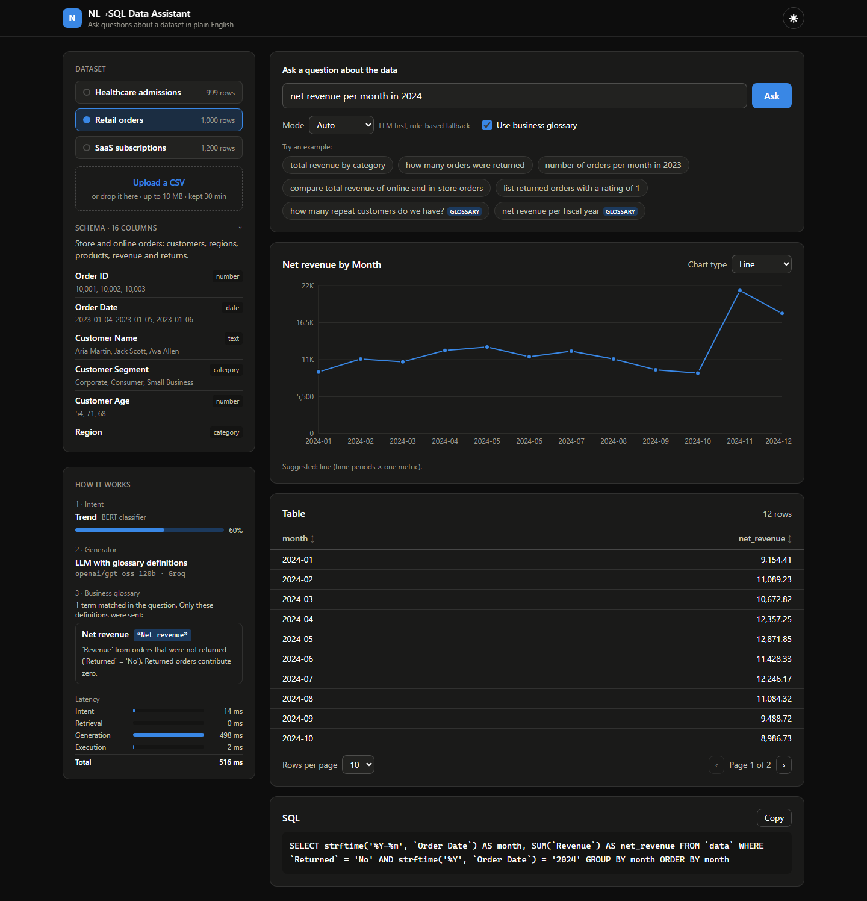
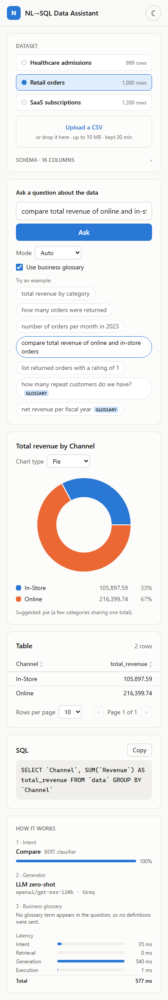
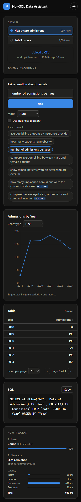

# RAG-Assisted Natural Language to SQL Query System

A natural-language data assistant for any tabular CSV dataset, with a FastAPI backend and a React UI.
A fine-tuned BERT classifier predicts each question's intent. An LLM (gpt-oss on Groq or Cerebras) writes
the SQL from the dataset's schema. When the question uses a company-specific business term, the
term's glossary definition is added to the prompt. Every query runs through a read-only safety layer, and
the rule-based v1 generator answers if the LLM is unavailable or its SQL is rejected.

**Pipeline:** question → intent (BERT) → glossary terms matched in the question → LLM SQL (rule-based fallback)
→ safety checks → table + chart, with every step shown in the "How it works" panel.

## 🌐 Live demo

**https://YOUR-APP.vercel.app** *(placeholder until the deployment is live)*

The React frontend is on Vercel and the API runs on Render's free plan, which sleeps after 15 idle
minutes. An uptime monitor normally keeps it awake. If it was asleep, the first visit can take about a
minute: the page says "Waking up the server…" and retries on its own. Try the sample datasets, or upload a
CSV of your own (up to 5 MB). Uploads stay in the server's memory for 30 idle minutes and are never written
to disk.

<table>
  <tr>
    <td></td>
    <td></td>
  </tr>
  <tr>
    <td align="center"><sub>Light: "logo churn rate by plan", glossary term matched</sub></td>
    <td align="center"><sub>Dark: "what is our ARR?", glossary term matched</sub></td>
  </tr>
  <tr>
    <td></td>
    <td></td>
  </tr>
  <tr>
    <td align="center"><sub>Light: no glossary term, zero-shot prompt</sub></td>
    <td align="center"><sub>Dark: "repeat customers", glossary term matched</sub></td>
  </tr>
</table>

---

## 📜 Project history

This repo is v2 of the project. Its full commit history carries over from the earlier versions:

1. **Original class project:** a healthcare-only NL-to-SQL system:
   [dangkhoa241/LLMs-powered-natural-language-query-system-for-healthcare](https://github.com/dangkhoa241/LLMs-powered-natural-language-query-system-for-healthcare)
2. **v1:** generalized to any CSV, with a Streamlit demo:
   [dangkhoa241/ML-assisted-natural-language-to-SQL-query-system](https://github.com/dangkhoa241/ML-assisted-natural-language-to-SQL-query-system)
   ([live demo](https://ml-assisted-natural-language-to-sql-query-system.streamlit.app/))

v2 replaces the rule-based SQL generator with an LLM (keeping it as the fallback), adds glossary
retrieval and benchmarks for both, and replaces the Streamlit UI with FastAPI + React.

---

## 🚀 v1: Enhanced Version

v1 was an enhanced version of the original project. Its intent classifier and rule-based SQL generator
are still part of v2: the classifier routes every question, and the rule-based generator is the fallback
when the LLM can't answer.

### What changed

* **Generalized beyond healthcare** — the original app only worked against `healthcare_dataset.csv`, with
  column names, category values, and keyword lists (gender, blood type, insurance provider, admission type,
  etc.) hardcoded directly into the SQL-generation logic. The app now inspects whatever CSV is uploaded at
  runtime and derives its column types, categories, and values from the data itself, so the same code works
  on a sales dataset, an HR dataset, a student dataset, and so on, unmodified.
* **Retrained the intent classifier on a domain-neutral dataset** — `intent_dataset.csv` previously contained
  only healthcare-phrased questions. It now contains 2,000 examples (400 per intent) spanning 14 domains
  (retail, education, HR, finance, sports, restaurants, real estate, IoT, library, logistics, social media,
  manufacturing, ecommerce, healthcare) so the BERT classifier generalizes instead of overfitting to one
  domain's vocabulary.
* **Graceful degradation without a trained model** — previously the app would hard-stop if `intent_model/`
  wasn't present. It now falls back to a lightweight keyword-based intent guesser so it's usable immediately,
  while still preferring the trained BERT classifier when available.
* **More robust filter/aggregate/trend logic** — numeric comparisons now correctly handle phrasing like
  "under age 40" (a word between the comparison term and the number), column matching uses exact word-token
  matching instead of substring matching (avoiding false positives like "orders" matching a column named
  `Order ID`), and trend queries now aggregate the metric actually asked about instead of always returning a
  raw row count.
* **Cleaner dependencies** — removed an invalid/non-existent package (`sqlite3-binary`) from
  `requirements.txt`; `sqlite3` is part of the Python standard library.

### What was evaluated and intentionally left out

* An LLM-API-driven SQL generator and two small local open-source text-to-SQL models were both evaluated.
  Both produced unreliable SQL for aggregate/compare/trend queries (missing `GROUP BY`, dropped aggregate
  functions, wrong comparison operators). The final design instead uses fully self-contained, rule-based SQL
  generation driven by the uploaded schema — no external API calls and no model download required to run it.
  v2 revisits this with retrieval-augmented prompting and a proper benchmark. See
  "Retrieval-Augmented SQL" below.

v1 had two components, plus a Streamlit UI that v2 replaced:

### 1. **Intent Classification Model**

* A custom fine-tuned intent classifier trained using `intent_dataset.csv`
* Built on top of a pretrained **BERT (`bert-base-uncased`)** Transformer model
* Trained on domain-neutral example questions (retail, education, HR, finance, sports, healthcare,
  and more) so it generalizes to whatever dataset is uploaded, rather than one specific domain
* Produces intent categories: *filter, count, aggregate, compare, trend*
* Stored in the `intent_model/` folder after training
* Used to decide which type of SQL query to generate and which chart to show
* Optional: if `intent_model/` hasn't been trained yet, the app falls back to a lightweight
  keyword-based intent guesser so it still works out of the box

### 2. **Schema-Aware SQL Generator**

* Hand-built, rule-based NL→SQL engine — no external LLM API calls
* Reads the uploaded CSV's actual columns, data types, and values at runtime, then:
  * matches mentioned category values against the real distinct values in each column
  * matches numeric comparisons ("over 90000", "under age 40") to the right numeric column
  * detects date-like columns and grouping columns from the data itself
* Because everything is derived from the uploaded schema instead of hardcoded column names,
  the same logic works on a healthcare dataset, a sales dataset, an HR dataset, etc.

---

## 📂 What This Project Contains

```text
data/
  healthcare_dataset.csv   # Sample dataset (healthcare admissions)
  retail_sales.csv         # Seeded synthetic retail dataset (sample + SQL benchmark)
  saas_subscriptions.csv   # Seeded synthetic SaaS accounts (sample + Stage 3C held-out domain)
  intent_dataset.csv       # Domain-neutral training data for the intent classifier

intent_model/              # Saved fine-tuned BERT intent classification model (after training)

eval/
  intent_hard_test.csv      # 150 hand-written hard test questions (see "Evaluation" below)
  evaluate_intent.py         # Compares BERT against keyword and TF-IDF baselines
  evaluate_sql.py            # Text-to-SQL benchmark: rule-based vs zero-shot LLM vs RAG
  evaluate_doc_retrieval.py  # Glossary retrieval: dense vs BM25 vs hybrid
  evaluate_stage3.py         # Stage 3: glossary RAG and model-size comparison (20b on Groq, 120b on Cerebras)
  evaluate_stage3c.py        # Stage 3C: term-gated glossary RAG, held-out SaaS domain
  stage3c_config.json        # Frozen Stage 3C settings (kept for reproducibility; the app reads config/)
  sql_metrics.py             # Execution-accuracy result-set comparison
  sql_benchmark/
    test_questions.jsonl     # 120 benchmark questions with gold SQL (healthcare + retail)
    glossary_questions.jsonl # 60 questions that need a business definition (Stage 3)
    build_glossary_questions.py # Builds and checks the glossary benchmark
    REVIEW.md                # 15 glossary questions written out for human review
    saas_questions.jsonl     # 60 held-out SaaS questions (Stage 3C)
    REVIEW_SAAS.md           # The SaaS questions written out for human review
    example_bank.jsonl       # 150 question -> SQL retrieval examples on 5 other schemas
    build_example_bank.py    # Builds the bank and executes every example's SQL
    check_benchmark.py       # Gold-query and bank/test leakage checks
    make_retail_dataset.py   # Generates data/retail_sales.csv (seeded)
  results/                    # Generated metrics, tables, failures, cached LLM responses

src/
  data_context.py            # CSV loading, type inference, SQLite table setup
  intent.py                   # Intent classifier (ONNX by default, or torch) + keyword-based fallback
  intent_onnx.py              # BERT inference with onnxruntime + tokenizers only
  sql_builder.py               # Schema-aware, rule-based NL -> SQL generation
  rag_sql.py                   # Retrieval-augmented NL -> SQL (Groq or Cerebras LLM + FAISS retrieval)
  doc_retrieval.py             # Business-glossary retrieval (dense, BM25, hybrid) and term gating
  sql_safety.py                # Read-only, single-SELECT, timeout + row-cap guardrails
  model_training.ipynb           # Notebook for training the intent model

docs/glossary/              # Business glossaries: healthcare.md, retail.md, saas.md
config/glossary_gating.json # The app's glossary-gating settings (a copy of eval/stage3c_config.json)

backend/                    # FastAPI app over src/: datasets, queries, limits (see "Running the app")
  glossary.py                # Term-gated glossary definitions (frozen Stage 3C settings)
  query_service.py           # intent -> glossary gate -> model chain (120b, then 20b) -> rule-based fallback
frontend/                   # Vite + React + TypeScript + Tailwind + Recharts UI

tests/                      # pytest: SQL safety, result comparison, LLM retries, and the API (tests/api/)
logs/                       # Training logs
requirements.txt           # App runtime: FastAPI, pandas, onnxruntime + tokenizers (no torch), Groq/OpenAI clients
requirements-eval.txt      # Benchmarks, tests, training, ONNX export: torch, transformers, retrieval (sentence-transformers, FAISS, BM25), pytest
render.yaml                # Render Blueprint: the backend as a native Python web service (free plan)
frontend/vercel.json       # Vercel: Vite build, SPA routing, cached assets
.env.example               # Template for .env (API keys, optional provider / model / fallback settings)
Dockerfile                 # One image: Node builds the frontend, Python serves it + the API (see "Deployment")
.dockerignore              # Allowlist of what the image may contain
space/README.md            # The Hugging Face Space's README (sdk: docker, app_port: 7860)
scripts/
  upload_intent_model.py    # intent_model/ -> a Hugging Face model repo
  export_intent_onnx.py     # BERT -> ONNX int8, checked against torch, uploaded to the repo's onnx/ folder
  prefetch_intent_model.py  # Downloads the ONNX intent model at build time (Render) to speed up cold starts
  deploy_space.py           # Uploads the app to a Hugging Face Docker Space
```

---

## 🧠 Model Training (Intent Classifier)

The intent classification model is built by fine-tuning a **BERT-based Transformer (`bert-base-uncased`)** on a labeled, domain-neutral intent dataset.

### Base Model

* **Pretrained Model:** `bert-base-uncased`
* **Architecture:** Bidirectional Transformer Encoder
* **Tokenizer:** WordPiece tokenizer (uncased)
* **Framework:** PyTorch + Hugging Face Transformers

### Training Dataset

* Source file: `data/intent_dataset.csv`
* 2,000 examples (400 per intent) spanning 14 domains — retail, education, HR, finance, sports,
  restaurants, real estate, IoT, library, logistics, social media, manufacturing, ecommerce, and
  healthcare — so the classifier isn't tied to healthcare phrasing
* Each sample contains:

  * A natural language question
  * A corresponding intent label (filter, count, aggregate, compare, or trend)

### Training Objective

The model is fine-tuned for a **multi-class text classification task** to learn how to map user questions to the correct analytical intent. The trained intent model directly controls:

* The structure of generated SQL queries
* The selection of visualization types (bar, line, pie, etc.)

### Training Pipeline

* Input: Natural language questions across many domains
* Tokenization: BERT tokenizer
* Model: `AutoModelForSequenceClassification`
* Loss Function: Cross-entropy loss
* Optimizer: AdamW
* Output: Trained intent classification model saved to `intent_model/`

### Purpose in the System

The fine-tuned BERT intent model enables:

* Accurate understanding of user analytical goals
* Reduced ambiguity before SQL generation
* Automatic and correct chart type selection

---

## 📊 Evaluation

### Why a hard test set

The notebook's validation split (50% of `intent_dataset.csv`) comes from the same templated, synthetic
distribution as the training data. On it, BERT scores 100%, but a TF-IDF + logistic regression baseline
also scores 99.9%. That split can't tell the models apart, so it doesn't justify using BERT.

`eval/intent_hard_test.csv` contains 150 hand-written questions (30 per intent):

* **`in_domain_hard` (75):** domains that appear in training, phrased the way people actually type. The
  questions mostly avoid trigger words like "how many", "average", "compare" and "trend", and they include
  typos, lowercase text without punctuation, multi-clause questions and indirect phrasing ("are men or
  women billed more", "which month did we sell the most").
* **`unseen_domain` (75):** domains that don't appear in training: airlines, hotels, agriculture, gaming,
  energy, insurance claims, car rental and telecom.

No hard-set question is an exact or near duplicate of a training question (every difflib ratio is ≤ 0.75).
Labels follow what each intent does in `sql_builder.py`:

| Intent | What the SQL returns |
|---|---|
| filter | matching rows |
| count | one row count |
| aggregate | a numeric metric per group |
| compare | a metric for a few named groups |
| trend | a metric over time buckets |

### Results

Run `python eval/evaluate_intent.py`. You need `requirements-eval.txt` installed and a trained
`intent_model/`. The script rebuilds the notebook's exact train/val split and trains the
TF-IDF baseline on the same 1,000 training rows that BERT used. Full output, including confusion
matrices, is in `eval/results/`.

| Model | val (n=1000) | hard (n=150) | in_domain_hard (n=75) | unseen_domain (n=75) |
|---|---|---|---|---|
| Keyword fallback | 0.657 / 0.669 | 0.240 / 0.136 | 0.240 / 0.133 | 0.240 / 0.139 |
| TF-IDF (1-2 gram) + LogReg | 0.999 / 0.999 | 0.693 / 0.689 | 0.667 / 0.662 | 0.720 / 0.718 |
| BERT (fine-tuned) | 1.000 / 1.000 | 0.847 / 0.841 | 0.853 / 0.837 | 0.840 / 0.844 |

*Cells are accuracy / macro-F1.*

Per-class F1 on the hard set:

| Model | aggregate | compare | count | filter | trend |
|---|---|---|---|---|---|
| Keyword fallback | 0.10 | 0.00 | 0.21 | 0.38 | 0.00 |
| TF-IDF + LogReg | 0.69 | 0.77 | 0.55 | 0.67 | 0.77 |
| BERT | 0.90 | 0.95 | 0.64 | 0.80 | 0.92 |

### What this shows

* **BERT is clearly better than the baselines once phrasing stops being templated.** On the hard set it
  beats TF-IDF by about 15 accuracy points (0.85 vs 0.69). The gap is largest on aggregate, compare and
  trend, where BERT recognizes indirect phrasing such as "what do houses go for in each neighborhood",
  "is fedex faster than ups" and "has the price of jet fuel been rising lately". TF-IDF has no n-gram
  match for these.
* **The val split overstates every model.** BERT drops from 100% to about 85%, and TF-IDF drops from 99.9%
  to about 69%. Treat the val score as a sanity check, not an accuracy estimate.
* **Count is BERT's weak spot (F1 0.64, recall 15/30).** If a question doesn't contain "how many" or
  "count", BERT usually predicts filter ("vacant rooms tonight, just the number", "employees on parental
  leave right now - just a number please"). Typos in the trigger phrase ("how manny", "hw mny") break it
  too. This is the most useful thing to fix in the training data.
* **New domains don't hurt BERT much here** (0.84 unseen vs 0.85 in-domain). With 75 rows per subset,
  though, the 95% confidence interval is about ±8 points, so this difference isn't meaningful. The
  `unseen_domain` subset tests vocabulary shift; its sentence structure is about as hard as the in-domain
  subset's.
* **The keyword fallback's 24% is partly by design.** Most hard-set questions deliberately avoid its
  trigger words, so most of them fall through to "filter". The result does show how brittle the fallback
  is on real phrasing, but it's a lower bound and shouldn't be read as a typical accuracy.
* **Caveats:** the hard set is small (150 rows), one person wrote and labeled it, and that person knew the
  keyword list when writing it. A few labels are judgment calls. For example, "which month did we sell the
  most" is labeled trend because it groups by time.

### A smaller intent model for a 512 MB host

The free hosting tier the app targets has 512 MB of RAM. The fp32 BERT model and torch don't fit in that.
All variants below were measured in Docker on Linux, with one inference thread, using
`eval/evaluate_intent.py` (accuracy) and `eval/benchmark_intent_quantization.py` (memory, latency):

| Variant | Hard set (n=150) | Val (n=1,000) | Weights | Process memory after 155 queries (heap + file) | Load | Latency median / p95 |
|---|---|---|---|---|---|---|
| fp32 (torch) | 0.847 | 1.000 | 418 MB | 303 + 451 MB | 4.7 s | 61 / 76 ms |
| int8 (torch, dynamic) | 0.833 | 1.000 | 173 MB | 413 + 456 MB | 7.6 s | 19 / 26 ms |
| **int8 ONNX (onnxruntime)**, the deployed one | **0.840** | **1.000** | **105 MB** | **194 + 49 MB** | **1.4 s** | **13 / 16 ms** |

**Int8 quantization in torch** (`INTENT_RUNTIME=torch INTENT_QUANTIZE=int8`, which still works for local
use) applies dynamic int8 quantization to every `Linear` layer when the model loads. It cost 1.4 points on
the hard set (two questions) and made inference 3× faster, but **it didn't reduce memory**:

* Transformers memory-maps the fp32 safetensors file, and the embeddings keep reading from that mapping, so
  the whole 418 MB file stays mapped.
* The quantized weights are new heap allocations on top of it.
* Quantizing in place (`inplace=True`) avoids a full copy of the model, which the default would make, but
  that only lowers the peak during loading.
* torch and transformers alone take about 250–300 MB of heap before any model is loaded.

The whole app container with int8 peaked at 1.08 GB and was OOM-killed at startup under
`docker run --memory=512m --cpus=0.1`.

**ONNX Runtime** is what the app runs:

* `scripts/export_intent_onnx.py` exports the fine-tuned model to ONNX and quantizes its weights to int8
  with `onnxruntime.quantization`. It then checks the result against torch on the 1,000 validation
  questions:
  * the fp32 export matches torch to 7×10⁻⁶ in the logits, with identical predictions;
  * the int8 export agrees with torch on every validation question.
* It uploads the files (`model_int8.onnx`, `tokenizer.json`, labels) to the model repo's `onnx/` folder.
* The app needs only `onnxruntime` and `tokenizers` for this (`src/intent_onnx.py`), so torch and
  transformers left the runtime requirements. Training, the evaluations and `INTENT_RUNTIME=torch` still use
  them, from `requirements-eval.txt`.

The result is 0.7 points lower on the hard set (one question), inside the 2-point budget set for this. It
uses about a third of fp32's memory, is 4× faster, and loads in 1.4 s. The Docker image shrank from 1.88 GB
to 626 MB.

---

## 🔎 Retrieval-Augmented SQL

v1's README says LLM-generated SQL was unreliable for aggregate, compare and trend queries. This stage
tests whether that's still true, and whether retrieval fixes it, by giving an LLM retrieved
question→SQL examples plus the relevant schema. (This section describes Stage 2. The app now uses
`rag_sql` through the FastAPI backend; see "Running the app".)

### Architecture

```text
question ──► embed (all-MiniLM-L6-v2) ──► FAISS top-k ──► k example question→SQL pairs ─┐
dataset  ──► build_schema_context(): columns, types, categorical values, min/max ───────┤
                                                                                       ▼
                              Groq LLM (openai/gpt-oss-120b, temperature 0) ──► SQL text
                                                                                       ▼
            validate_sql(): one SELECT/WITH statement, no write or admin keywords
                     │ rejected, or LLM call failed                    │ ok
                     ▼                                                 ▼
          rule-based sql_builder (v1)      read-only DB copy + 5 s timeout + 1,000-row cap
```

* **`src/rag_sql.py`:** `build_schema_context`, `retrieve_examples`, and `generate_sql(question,
  dataset, mode)` with `mode` set to `llm_zero_shot` (schema only) or `llm_rag` (schema plus k
  examples). The model name, embedding model and default k are config constants at the top of the
  file. The API key comes from `GROQ_API_KEY` in `.env`; copy `.env.example`.
* **`src/sql_safety.py`:** three independent layers.
  1. A static check that allows a single `SELECT`/`WITH` statement and rejects `;`-chained
     statements, `PRAGMA`, `ATTACH`, DDL and DML. Keywords inside string literals, quoted
     identifiers and comments are ignored.
  2. Execution on a private in-memory copy of the database with `PRAGMA query_only` and an
     authorizer that only permits reads.
  3. A wall-clock timeout and a row cap.
* **Example bank (`eval/sql_benchmark/example_bank.jsonl`):** 150 question→SQL pairs on 5 schemas
  that don't appear in the benchmark: HR, school, logistics, hotel and energy. The bank teaches SQL
  patterns but can't leak benchmark answers. Every bank query is executed when the bank is built.

### Design choices

* **FAISS over Chroma.** The bank is a 150-row, version-controlled JSONL file, and FAISS covers what
  it needs:
  * exact search with `IndexFlatIP` over unit vectors, which is cosine similarity;
  * one pip wheel;
  * no server, no SQLite-backed store, no telemetry, and no extra persistence layer to keep in sync.

  The index is a rebuildable artifact, cached in `.rag_cache/` and keyed by the bank's hash.
  Chroma's metadata filtering and incremental upserts would only pay off with a large, changing
  example store.
* **`all-MiniLM-L6-v2` for embeddings.** It's small, fast on CPU and free. Its similarity scores are
  spread out enough for the leakage check (cosine > 0.9) to be meaningful.
* **`openai/gpt-oss-120b` on Groq.** It's the strongest general model on Groq's current list. It
  runs with low reasoning effort to keep latency and token use down.
* **The safety failure mode is fallback.** If the LLM call fails or its SQL is rejected, the app
  still answers, using the v1 rule-based generator.

### Benchmark

* **Data:** 120 questions with gold SQL, 60 on `healthcare_dataset.csv` and 60 on a seeded synthetic
  `retail_sales.csv` (1,000 orders), with 12 per intent per dataset. Every gold query was executed.
  Filters return 3–71 rows, and top-N questions have no ties at the LIMIT boundary.
* **Leakage check:** `eval/sql_benchmark/check_benchmark.py` compares every bank question with every
  test question. It caught one exact duplicate, which was then reworded. After that, the maximum
  embedding cosine is **0.80** ("average billing amount by year" vs "average bill by year") and the
  maximum difflib ratio is **0.82**, both under the 0.9 and 0.85 limits.
* **Metric: execution accuracy.** The generated SQL's result set must equal the gold result set.
  * Rows are compared as a multiset, or in order if the question asks for a ranking.
  * Floats are rounded to 2 decimals.
  * Column names and order are ignored. Extra predicted columns are allowed, but every gold column
    must be matched.
  * The comparison logic is in `eval/sql_metrics.py` and covered by `tests/`.
* **Run it** with `python eval/evaluate_sql.py`. Every LLM response is cached in
  `eval/results/llm_cache.jsonl`, keyed by model and prompt hash, so re-runs make no API calls.
  * A run from an empty cache needs about 480 calls (~400K tokens), which is more than Groq's free
    tier allows in a day (200K tokens). The script stops cleanly at the quota and resumes from the
    cache.
  * The script pins `PYTHONHASHSEED` because of a rule-based bug described below.

### Results

| System | Overall | Healthcare | Retail | SQL errors | Rejected by safety | Fallbacks |
|---|---|---|---|---|---|---|
| rule_based (BERT intent, as in the app today) | **30.8%** (37/120) | 36.7% | 25.0% | 0 | 0 | 0 |
| rule_based_gold_intent (true intent) | **32.5%** (39/120) | 38.3% | 26.7% | 0 | 0 | 0 |
| llm_zero_shot (schema only) | **99.2%** (119/120) | 98.3% | 100.0% | 0 | 0 | 0 |
| llm_rag (schema + 3 examples) | **93.3%** (112/120) | 96.7% | 90.0% | 1 | 1 | 1 |

Accuracy by intent:

| System | filter | count | aggregate | compare | trend |
|---|---|---|---|---|---|
| rule_based | 21% | 38% | 54% | 17% | 25% |
| rule_based_gold_intent | 21% | 38% | 54% | 17% | 33% |
| llm_zero_shot | 100% | 100% | 100% | 96% | 100% |
| llm_rag | 92% | 100% | 88% | 88% | 100% |

Ablation over the number of retrieved examples (k=0 sends exactly the zero-shot prompt):

| k | Overall | filter | count | aggregate | compare | trend | SQL errors |
|---|---|---|---|---|---|---|---|
| 0 | **99.2%** | 100% | 100% | 100% | 96% | 100% | 0 |
| 1 | **80.0%** | 92% | 96% | 58% | 83% | 71% | 2 |
| 3 | **93.3%** | 92% | 100% | 88% | 88% | 100% | 1 |
| 5 | **95.8%** | 96% | 100% | 92% | 96% | 96% | 0 |

Full results: `eval/results/sql_results.md` / `.json`. Every question that any system got wrong is
listed in `eval/results/sql_failures.csv`.

### What this shows

**The hypothesis was wrong for this model and benchmark.** A current LLM given a good schema context
(types, actual categorical values, date format and ranges) doesn't make the errors v1 ran into.
Zero-shot got every `GROUP BY`, aggregate and operator right, with no SQL errors. Retrieval had
nothing left to fix: it never turned a wrong zero-shot answer into a right one, and it broke 7 that
zero-shot got right.

**Why retrieval hurt.** I traced every RAG failure back to its retrieved examples and raw response.
There were two causes:

1. **Retrieval matches on topic, not SQL shape.** "Average order revenue by region" retrieved hotel
   *revenue* examples (similarity 0.41–0.50) instead of an "average X by Y" pattern.
2. **The examples conflict with the target schema.** Every bank example queries a table also named
   `data`, but with different columns. With low reasoning effort the model sometimes resolves the
   conflict badly:
   * it copies an example outright (`SELECT Cancelled, AVG(Total Price) ...`, a hotel query, for a
     retail question);
   * it substitutes an example's filter value (`Category = 'Electronics'` instead of
     `Customer Segment = 'Corporate'`);
   * it gives up (`SELECT 1`, `SELECT * FROM data LIMIT 0`, or `LIMIT 3` with the WHERE clause
     dropped).

   This second cause is partly a prompt-design flaw on my side. Fixing it is the obvious next step
   (see below).

**The ablation fits that explanation.** k=1 is worst (80%) because a single off-topic example
dominates the prompt. More examples dilute any one bad example: k=3 scores 93% and k=5 scores 96%.
None of them beats k=0.

**The rule-based generator is far weaker than its v1 demos suggested,** and the intent model isn't
the bottleneck: BERT predicts 88% of benchmark intents correctly, and giving it the true intent only
adds 2 points. The failures are in SQL construction:

* **Filters are dropped or wrong.**
  * "Over 80" is ignored when the word "age" isn't nearby.
  * "Older than 65" and "between 30 and 40" aren't recognized at all.
  * "Under 2000" becomes a filter for the *year* 2000.
* **Compare questions group by the wrong column.** Without a "by X" phrase, it groups by the
  lowest-cardinality column. "Cigna vs Aetna average billing" is grouped by Gender.
* **The wrong aggregate is chosen.** "Highest bill" doesn't match the column name "Billing Amount",
  so it falls back to `COUNT(*)`.
* **Some questions are out of reach entirely:** top-N, `COUNT(DISTINCT)`, lengths of stay, and
  free-text values such as a customer name.
* **The date column is nondeterministic.** `sql_builder` picks it with `next(iter(set))`, so on the
  healthcare data it's *Date of Admission* in some processes and *Discharge Date* in others. Total
  accuracy moves between 27.5% and 32.5% depending on Python's hash seed. The numbers above use a
  pinned seed. The bug wasn't fixed in this stage; Stage 3 fixed it.

**Remaining LLM misses are mostly judgment calls.** Zero-shot's one miss ("normal vs abnormal test
results") also returned the third group, "Inconclusive". One RAG miss answered "which sells more,
yoga mats or water bottles" with only the winning row. The metric counts both as wrong.

**Caveats:**

* The benchmark is small (n=120; the 95% confidence interval on 99.2% is about 95–100%).
* It's single-table, and I wrote both the questions and the gold SQL.
* The LLM prompt states the same output conventions the gold SQL follows: `SELECT *` for listings,
  one row per compared group, and `strftime` buckets. This is a best case for the LLM systems. The
  rule-based system doesn't share those conventions, though the column-flexible metric reduces the
  difference.
* One RAG output was an empty response, counted under "Rejected by safety"; the fallback answered
  that question correctly.

**What this means for the next stage:**

* Use `llm_zero_shot` as the primary generator, with the rule-based path as the safety fallback.
* Keep RAG off by default until it's fixed. Candidate fixes:
  * give each example its own table name and schema line, so it can't be confused with the user's table;
  * retrieve by SQL pattern rather than topic, for example by masking domain nouns before embedding,
    or by filtering the bank by predicted intent;
  * add a minimum-similarity threshold, below which no examples are sent.
* RAG is most likely to help on harder schemas, such as multi-table joins, unusual column semantics
  or domain-specific definitions. This benchmark doesn't test those.

### Stage 3: business definitions and model size

Stage 2 found that the schema alone was enough context for the original 120 questions. Stage 3 asks
two questions:

1. Does retrieval help when the schema *isn't* enough, because the question uses a company-specific
   business term?
2. Can a smaller model plus retrieval match a larger model?

#### What was added

* **Business glossaries** (`docs/glossary/healthcare.md`, `retail.md`), with 26 definitions each.
  Several definitions are deliberately different from the everyday reading:
  * a *senior patient* is 67 or older, not 65;
  * *government payers* are Medicare **and** UnitedHealthcare;
  * the hospital's fiscal year runs July–June and the retailer's runs February–January;
  * a *returning customer* ordered in both 2023 and 2024, and the term has nothing to do with returns.

  The glossaries also contain near-miss distractors: *senior care tier* (80+) next to *senior
  patient*, *premium room* next to *premium insurer*, and *net sales* next to *net revenue*.
* **A 60-question glossary benchmark** (`eval/sql_benchmark/glossary_questions.jsonl`): 30 questions
  per dataset and 12 per intent. Each question uses at least one term without restating it. Each comes
  with the IDs of the definitions it needs, gold SQL, and a `naive_sql` for the plausible everyday
  reading. Every naive query was checked to give a different answer from the gold. 15 questions are
  written out for human review in `eval/sql_benchmark/REVIEW.md`.
* **Glossary retrieval** (`src/doc_retrieval.py`), using dense embeddings, BM25, or both fused with
  reciprocal rank fusion. The hybrid retriever was best: recall@3 **93.3%**, and 90% of questions had
  every needed definition in the top 3 (`eval/results/doc_retrieval_results.md`).
* **The Stage 2 example-retrieval fixes.** Each example now shows its own table name and schema, the
  bank is filtered by predicted intent, and examples below cosine 0.35 aren't sent. This system is
  called `example_rag_fixed`.
* **The `sql_builder` hash-seed bug** described above is fixed. The date column is now chosen
  deterministically.

#### Setup

* **Systems.** On the glossary set:
  * `zero_shot`: schema only;
  * `doc_rag`: schema plus the top-3 retrieved definitions;
  * `oracle_doc`: schema plus exactly the needed definitions, which is an upper bound for `doc_rag`.

  On the original 120 questions: `zero_shot`, `example_rag_fixed`, and `doc_rag`. Running `doc_rag`
  there checks whether irrelevant definitions do harm.
* **Models.** `gpt-oss-20b` runs on **Groq**, and `gpt-oss-120b` runs on **Cerebras**. Both use the
  same prompts, temperature 0, low reasoning effort and a 1,024-token completion cap.
  * The 120b moved to Cerebras because Groq's free-tier daily token cap would have spread its 516
    calls over several days. Cerebras finished them in one afternoon.
  * Every 120b number in this section comes from Cerebras, and every 20b number comes from Groq. The
    Stage 2 tables above are Groq results.
  * Cerebras reproduces Stage 2's 120b zero-shot result exactly: 99.2%, with the same single miss.
* **Running it.** `python eval/evaluate_stage3.py run --model gpt-oss-20b|gpt-oss-120b --wait` makes
  the calls, and `python eval/evaluate_stage3.py report` scores everything from the caches.
  * The provider is part of the cache key, and each model has its own cache file in `eval/results/`.
  * Cerebras calls are throttled to 5 per minute. The run also hit a ~300 requests/hour limit once
    and slept through it.

#### Results

Glossary set (60 questions that need a business definition):

| System | gpt-oss-20b (Groq) | gpt-oss-120b (Cerebras) |
|---|---|---|
| zero_shot (schema only) | **10.0%** (6/60) | **10.0%** (6/60) |
| doc_rag (top-3 retrieved definitions) | **86.7%** (52/60) | **88.3%** (53/60) |
| oracle_doc (exactly the needed definitions) | **95.0%** (57/60) | **95.0%** (57/60) |

Original set (the 120 Stage 2 questions):

| System | gpt-oss-20b (Groq) | gpt-oss-120b (Cerebras) |
|---|---|---|
| zero_shot | **98.3%** (118/120) | **99.2%** (119/120) |
| example_rag_fixed (Stage 2's llm_rag: 93.3%) | **97.5%** (117/120) | **100.0%** (120/120) |
| doc_rag (glossary definitions, none needed) | **94.2%** (113/120) | **95.0%** (114/120) |

Small vs. large, question by question. "Only 20b" counts questions the 20b got right and the 120b
got wrong.

| Set | System | Both right | Only 20b | Only 120b | Both wrong |
|---|---|---|---|---|---|
| glossary | zero_shot | 4 | 2 | 2 | 52 |
| glossary | doc_rag | 49 | 3 | 4 | 4 |
| glossary | oracle_doc | 55 | 2 | 2 | 1 |
| original | zero_shot | 118 | 0 | 1 | 1 |
| original | example_rag_fixed | 117 | 0 | 3 | 0 |
| original | doc_rag | 111 | 2 | 3 | 4 |

Full tables (by dataset and intent, failure breakdowns, latency and tokens) are in
`eval/results/stage3_results.md` / `.json`. Every wrong answer is in `eval/results/stage3_failures.csv`,
with the retrieved chunk or example IDs.

#### What this shows

**Business definitions are knowledge the model doesn't have, and model size doesn't supply it.**
Both models score 10% on the glossary set without definitions. The model six times larger is no
better: each model got 2 questions right that the other missed. Many wrong answers are exactly the everyday reading the benchmark was built to catch (14 of the 20b's
and 19 of the 120b's answers match `naive_sql`):

* "senior patients" became `Age >= 65`;
* "government payers" became Medicare only;
* "fiscal year" became the calendar year;
* "returning customers" became `Returned = 'Yes'`.

**Retrieved definitions close almost all of that gap.** Accuracy goes from 10% to 87–88% with
retrieved definitions and to 95% with the exact ones. The small model plus retrieval (86.7%) beats
the large model without it (10.0%) by 77 points.

**On this benchmark, context matters far more than model size.** Given the same context, the two
models are never more than 2.5 points apart (3 of 120 questions), and they tie on `oracle_doc`. At low reasoning effort, the 20b is a reasonable choice whenever
the right context is in the prompt.

**The remaining `doc_rag` gap is mostly retrieval.**

* Both models miss the same 4 questions, and in each of them a needed definition wasn't retrieved.
* A retrieved distractor can make things worse than retrieving nothing. For "high-cost admissions of
  senior patients", the retriever returned *senior care tier* (80+) instead of *senior patient*
  (67+), and both models wrote `Age >= 80`.
* Where the definitions were all present, the remaining misses come from SQL details, especially
  fiscal-year arithmetic (see below).

**The Stage 2 example-retrieval fixes worked.** Example RAG went from 93.3% (Stage 2) to 97.5–100%.
It no longer hurts the 120b, and its 3 extra correct answers are within noise. It still doesn't
reliably beat zero-shot: the 20b drops 0.8 points.

**Irrelevant definitions cost a few points.** `doc_rag` on the original set (no definitions needed)
scores 95.0% for the 120b (99.2% zero-shot) and 94.2% for the 20b (98.3% zero-shot). Both models
applied definitions the question didn't use, despite the prompt telling them not to:

* *billable days* (+1 day) was applied to plain "length of stay" questions;
* the *AOV* rule (non-returned orders only) was applied to "average order revenue".

The AOV case is arguably a conflict between the glossary and the Stage 2 gold SQL rather than a
model error. Either way, the app should only add definitions whose term actually appears in the
question, for example with a retrieval-score or term-match gate, rather than always sending the
top 3.

**Notable failures:**

| Question | System | What went wrong |
|---|---|---|
| number of admissions per fiscal year | 20b oracle_doc | The `CASE` returns text in one branch and an integer in the other, so SQLite puts `'2021'` and `2021` in separate groups |
| net revenue per fiscal year | 120b oracle_doc | The same text/integer mix in its fiscal-year label, although the definition was right |
| how many returning customers are there? | 120b doc_rag + oracle_doc | `strftime('%Y','`Order Date`')`: quoting the column name turns it into a string literal, so every year is NULL |
| patients on Lipitor with abnormal test results admitted in 2023 | 120b doc_rag | It wrote `'Lipicon'`, a value that appears nowhere in the data. Zero-shot spelled it correctly |
| hard goods vs soft goods: average revenue per order | 120b zero_shot | It guessed the hidden definition exactly, then selected `Revenue` from a subquery that didn't include it |
| how many bulk buyers are there? | 20b doc_rag | `COUNT(DISTINCT ...)` with `GROUP BY` returns a 1 for each buyer instead of one count |
| compare CSAT between B2B and consumer orders | 120b doc_rag + oracle_doc | It returned the three segments separately instead of merging Corporate and Small Business into B2B |
| show patients with premium insurers and flagged results... | both, doc_rag | *Premium insurer* wasn't retrieved, so both models listed all five insurers (*premium room* was retrieved instead) |

**Latency and cost.**

* The models ran on different providers, so their latencies can't be compared: the difference is as
  much about hardware as model size. Median client latency was 0.32 s for the 120b on Cerebras and
  0.40 s for the 20b on Groq.
* The 120b's 516 calls used 457K tokens. Cerebras served 324K of them from its prompt cache, so only
  133K uncached tokens counted against the daily limit. The full run cost $0.18 in Cerebras
  credits, about $0.00035 per query.
* The 20b's 516 calls used 452K tokens on Groq. Once the free tier's daily token cap was reached,
  the run slowed to about one call every 5–7 minutes.

**Caveats:**

* The glossary set is small (n=60), and the 95% confidence interval on 87% is roughly ±9 points.
  The model-size differences are well inside that.
* I wrote the glossaries, the questions and the gold SQL. The definitions are deliberately
  counterintuitive so that the model can't already know them. Real company glossaries are often
  closer to everyday usage, so the zero-shot score here is a worst case.
* Each system was run once, at temperature 0. The two models are served by different providers,
  so any serving differences, such as numerics or kernels, are confounded with model size.

**Next stage:** integrate into the app with `zero_shot` as the default generator and glossary
retrieval behind a relevance gate. Stage 3C chose the gate (term and alias matching, tuned on the dev
domains only and frozen in `eval/stage3c_config.json`) and, on its held-out domain, reversed the model
choice suggested here: the 120b is clearly ahead once the definitions involve arithmetic. The app uses
the gate with gpt-oss-120b as the primary model and gpt-oss-20b as its fallback; see "Running the app".

### Held-out domain (SaaS)

Stage 3B left two problems:

1. Definitions a question doesn't need still cost about 4 points.
2. Retrieval sometimes returned a near-miss distractor instead of the needed definition.

Stage 3C fixes both with **term gating**: a definition is sent only if its term, or one of its listed
aliases, appears in the question. The fix was tuned on healthcare and retail only, then tested once on
a third domain that played no part in any decision.

#### Method

* **Held-out data.** A seeded SaaS subscriptions table (`data/saas_subscriptions.csv`: 1,200
  accounts, 487 of them cancelled) and a 29-term glossary (`docs/glossary/saas.md`).
  * The glossary fixes a reporting as-of date of 2025-06-30, so terms like *active account* and
    *recently churned* give a deterministic answer.
  * Its rules are non-obvious. For example, *churned* means cancelled more than 14 days after
    signup; earlier cancellations are *trial drop-offs*. *ARR* counts only annual-billing accounts.
  * 5 terms are near-miss distractors: ACV vs. ARR, dormant vs. active, recent signup vs. new logo,
    enterprise-scale vs. strategic, and passive vs. detractor.
  * The glossary and its aliases were written before any question.
* **60 held-out questions** (`eval/sql_benchmark/saas_questions.jsonl`):
  * 40 need a definition (8 per intent). Each has gold SQL and a naive everyday reading that gives a
    different answer.
  * 20 plain questions need none. Several sit next to a glossary term ("average MRR by plan",
    "number of cancellations per year") to test whether unneeded definitions get applied.
  * 15 are written out for review in `REVIEW_SAAS.md`.
* **Tuning on the dev set only.**
  * Aliases were added to the healthcare and retail glossaries without changing any definition
    text, so every Stage 3B prompt stayed byte-identical and cached.
  * On dev, gating sent exactly the required definitions for all 60 glossary questions and none for
    the 120 original questions. That is optimistic by construction, because I wrote those aliases
    while looking at the dev questions.
  * Because gating missed nothing on dev, no retrieval fallback was added.
  * The settings were frozen in `eval/stage3c_config.json` before any SaaS call
    (`eval/evaluate_stage3c.py`).
* **Same setup as Stage 3B:** gpt-oss-20b on Groq, gpt-oss-120b on Cerebras, temperature 0, low
  reasoning effort.

#### Results

Dev set (tuning data):

| System | Glossary 20b | Glossary 120b | Original 20b | Original 120b |
|---|---|---|---|---|
| doc_rag (ungated top-3) | 86.7% | 88.3% | 94.2% | 95.0% |
| **doc_rag_gated** | **95.0%** | **91.7%** | **98.3%** | **99.2%** |
| oracle_doc / zero_shot | 95.0% (oracle) | 95.0% (oracle) | 98.3% (zero-shot) | 99.2% (zero-shot) |

**Held-out SaaS set** (frozen settings, run once):

| System | Glossary (40): 20b | Glossary (40): 120b | Plain (20): 20b | Plain (20): 120b | All 60: 20b | All 60: 120b |
|---|---|---|---|---|---|---|
| zero_shot | 0.0% | 0.0% | 95.0% | 100.0% | 31.7% | 33.3% |
| doc_rag (ungated top-3) | 67.5% | 77.5% | 100.0% | 100.0% | 78.3% | 85.0% |
| **doc_rag_gated** | **80.0%** | **95.0%** | **95.0%** | **100.0%** | **85.0%** | **96.7%** |
| oracle_doc | 85.0% | 97.5% | n/a | n/a | n/a | n/a |

Which definitions reached the prompt (this doesn't depend on the model):

| SaaS set | System | Has every needed definition | Exact set | Precision | Questions given an unneeded definition |
|---|---|---|---|---|---|
| glossary (40) | doc_rag | 75.0% | 0% | 31.7% | 40 |
| glossary (40) | doc_rag_gated | **97.5%** | **95.0%** | **98.0%** | 1 |
| plain (20) | doc_rag | n/a | n/a | 0% | 20 |
| plain (20) | doc_rag_gated | n/a | n/a | n/a | **0** |

Small vs. large on the SaaS glossary set, question by question:

| System | Both right | Only 20b | Only 120b | Both wrong |
|---|---|---|---|---|
| zero_shot | 0 | 0 | 0 | 40 |
| doc_rag | 25 | 2 | 6 | 7 |
| doc_rag_gated | 31 | 1 | 7 | 1 |
| oracle_doc | 33 | 1 | 6 | 0 |

Full results are in `eval/results/stage3c_saas_results.md` / `.json`, and every wrong answer is in
`stage3c_saas_failures.csv`.

#### What this shows

**Gating held up on the unseen domain.**
* For the 120b, it raised the glossary set from 77.5% (ungated) to 95.0%, within one question of
  the oracle (97.5%). The 20b went from 67.5% to 80.0%.
* On the plain questions, gating sent no definitions at all, so those prompts were exactly the
  zero-shot ones.
* Ungated `doc_rag` gave every question three definitions. On the glossary set, only 31.7% of those
  were ones the question needed, and a quarter of the questions were missing a needed one.
* Overall, gating scored 85.0% (20b) and 96.7% (120b) on all 60 questions, against 78.3% and 85.0%
  ungated. **All of that gain came from the glossary questions.**

**The "unneeded definitions" problem didn't reproduce on SaaS.** On dev, sending definitions to
questions that didn't need them cost about 4 points. On the SaaS plain questions, ungated `doc_rag`
scored 100% for both models, even with three irrelevant definitions in every prompt. The SaaS
definitions mostly name distinct concepts and don't redefine plain words; the dev case was *billable
days* being applied to "length of stay". So gating made no difference on the plain set. For the
20b it was one question worse: sp_p03 is a miss that zero-shot makes too, and the extra context
happened to fix it. The protection gating gave on dev's original set is real, but on this held-out
domain it was never needed.

**Without definitions, both models scored 0 of 40.** That's lower than the dev domains (10%),
because the SaaS rules are less guessable. Typical wrong answers:
* "active accounts" became `Cancel Date IS NULL`, ignoring the 30-day login rule;
* "churned in fiscal year 2024" became calendar 2024 and included trial drop-offs;
* "enterprise-scale" became `Plan = 'Enterprise'`.

**Unlike on dev, the larger model now leads clearly.** Both models got exactly the same definitions,
yet the 120b scored 95.0% gated and 97.5% with the oracle definitions, against 80.0% and 85.0% for
the 20b. Under gating, 7 questions were right only for the 120b and 1 only for the 20b. Most of the
20b's extra misses are SQL mistakes rather than misreadings of a definition: SQLite integer division
and missed filters (see below). The SaaS definitions involve more arithmetic (ratios, percentages,
date differences) than the dev ones.

**The one gating miss was an alias gap, not a matching bug.** In "list **over-provisioned Pro
accounts** in APAC", the plan name sits inside the term "over-provisioned account", and the
single-word alias was spelled "overprovisioned". Neither matched, so both models guessed. The
120b's guess, `Seats Used > Seats`, is the opposite of the definition.

*Post-hoc, not part of the frozen result:* with "over-provisioned" added as an alias, that question
gets exactly the oracle prompt, which both models already answer correctly. Gated accuracy would
then be 82.5% (20b) and 97.5% (120b). The frozen numbers above stay the reported ones.

**Notable failures:**

| Question | System | What went wrong |
|---|---|---|
| seat utilization by region | 20b gated + oracle | `SUM(Seats Used) / SUM(Seats) * 100` in SQLite is integer division, so every region gets 0 |
| net promoter score by industry / by signup year | 20b gated + oracle | The same integer division in `SUM(...) / COUNT(NPS)`. The definition was applied correctly |
| do paid-acquisition accounts have a higher logo churn rate? | 20b gated | It filtered to cancelled accounts first, so both groups show a 100% churn rate |
| compare the number of detractors and passives | 120b, all three systems with definitions | `CASE` without an `ELSE` leaves promoters (9–10) as a third, unlabeled `NULL` group |
| compare ARR between EMEA and North America | 20b gated + oracle | ARR was right, but it returned all four regions |
| total MRR of at-risk accounts by plan | 120b doc_rag | *At-risk* wasn't retrieved, so the model used **cancelled** accounts: the opposite of the definition |
| count the detractors in EMEA | 120b doc_rag | Only the *passive* distractor was retrieved, and the model fell back to the textbook detractor rule (≤ 6) |
| trial drop-offs per fiscal year | 20b gated + oracle | The fiscal-year label mixes text and integers again (as in Stage 3B), splitting groups |

**BERT intent accuracy on SaaS** (a domain the classifier never saw) was **75.0%**, against 86.7%
on dev. Trend questions phrased "X by signup year" are mostly read as aggregate or count (16.7%
correct). This doesn't affect the LLM systems above, which don't use the predicted intent for
glossary retrieval.

**Cost.**
* The 120b's 165 calls on Cerebras used 137K tokens, of which 94K were served from the prompt cache.
  That's about **$0.05** at Stage 3B's observed rate.
* The 20b's 165 calls used 138K tokens on Groq, and the run was again paced by the free tier's daily
  token cap.

**Caveats:**

* The held-out set is small: 40 glossary questions plus 20 plain ones, so one question is 2.5
  points on the glossary set.
* One author wrote the SaaS data, glossary, aliases, questions and gold SQL. The aliases were fixed
  before the questions were written, but my phrasing habits still carry over to both.
* Gating can only send what the alias lists cover. A real glossary would need curated aliases, or a
  retrieval fallback for questions that match nothing.
* Each system was run once, at temperature 0. The model comparison is confounded with the provider,
  as in Stage 3B.

---

## 🔍 What Makes This Project Unique

* Works on **any uploaded CSV**: columns, types and values are discovered at runtime and sent to the LLM
  as schema context
* **Business definitions only when they apply:** a glossary definition is added to the prompt only if
  its term or an alias appears in the question, so ordinary questions get the plain zero-shot prompt
* **Measured, not assumed:** each design choice (zero-shot over example RAG, glossary context over a
  bigger model, term gating) comes from a benchmark in this repo (see "Evaluation" and
  "Retrieval-Augmented SQL")
* **Safe by construction:** LLM SQL runs read-only, single-statement, time- and row-capped, with a
  rule-based fallback
* **Transparent:** the UI shows the intent, the generator, the matched glossary terms and the
  definitions sent, the SQL, and per-step latency

---

## 🧠 Example Workflow

**User picks the SaaS sample dataset and asks:**

> "What is our ARR?"

**System:**

1. Intent model → **count** (BERT)
2. Glossary gate → the question contains the term *ARR*, so its definition is sent: only Annual-billed
   accounts with no cancel date, `SUM(MRR) × 12`
3. LLM (gpt-oss) → writes:
   ```sql
   SELECT SUM(`MRR`)*12 AS `ARR` FROM data WHERE `Billing Cycle`='Annual' AND `Cancel Date` IS NULL
   ```
4. Safety layer → one read-only `SELECT`, run on a private copy with a timeout and a row cap
5. Result → a big-number card, with the matched term and its definition in "How it works"

Asked "total MRR by plan" instead, no glossary term matches, nothing extra is sent, and the prompt is the
zero-shot one. On an uploaded CSV, which has no glossary, every prompt is zero-shot.

---

## 🖥️ Running the app

The app is a **FastAPI backend** (`backend/`) and a **React frontend** (`frontend/`). The backend reuses
the `src/` modules: the BERT intent classifier, `rag_sql` (LLM generation, Groq or Cerebras),
`doc_retrieval` (glossary term matching), `sql_builder` (rule-based fallback) and `sql_safety`.

**Prerequisites:** Python 3.11, Node.js 20.19+ or 22.12+, and a `.env` in the repo root with `GROQ_API_KEY`
(copy `.env.example`), or `CEREBRAS_API_KEY` with `LLM_PROVIDER=cerebras`. Without a key the app still
works: auto mode answers with the rule-based generator.

**Backend** (PowerShell, from the repo root):

```powershell
python -m venv .venv
.venv\Scripts\Activate.ps1
pip install -r requirements.txt
uvicorn backend.main:app --port 8000
```

Startup takes a few seconds (it loads the intent model and parses the glossaries once). Check it with
`curl http://127.0.0.1:8000/api/health`. The intent model runs on ONNX Runtime and looks for an `onnx/`
folder under `INTENT_MODEL_PATH`:
* the default is `intent_model/`, after `python scripts/export_intent_onnx.py`;
* set `INTENT_MODEL_PATH=dangkhoa241/nl2sql-intent-model` in `.env` to download it from the Hub;
* without either, the app logs why and uses keyword-based intents.

**Frontend** (a second terminal):

```powershell
cd frontend
npm install
npm run dev
```

Open http://localhost:5173. Vite proxies `/api` to port 8000, so the browser only talks to one origin.

**Tests:**

```powershell
pip install -r requirements-eval.txt    # once: pytest, plus the benchmark dependencies
python -m pytest tests                  # backend + src (LLM mocked, no network; glossary matching is real)
cd frontend
npm test                                # Vitest: chart selection + components
npx playwright install chromium         # once
npm run e2e                             # Playwright smoke test (mocked backend)
```

### API

| Endpoint | What it does |
|---|---|
| `GET /api/samples` | The built-in datasets (healthcare, retail, SaaS): schema, row count, example questions |
| `POST /api/datasets` | Upload a CSV (multipart field `file`, ≤ 10 MB) → `dataset_id`, rows, schema (types + sample values) |
| `POST /api/query` | `{dataset_id, question, mode, use_glossary}` → intent + confidence, generator (the model that answered, a note if it was the fallback model, every model tried, and why it fell back), SQL, columns, rows (≤ 500), suggested chart, matched glossary terms with the definitions sent, latency per step |
| `GET /api/config`, `GET /api/health` | Server defaults (mode, glossary, provider, primary and fallback models, remaining budget) and status |

Errors always have the shape `{"error": {"code", "message"}}`, never a stack trace.

**Modes:**
- `auto` (the default) asks the LLM first: zero-shot, which Stage 2 found most accurate, plus any matched glossary definitions. It falls back to the rule-based generator when every model in the chain is out of quota or rate-limited, the app's own limits are hit, the call fails, or the SQL is rejected by the safety layer or errors. `generator.fallback_reason` says which.
- `llm` never falls back to the rule-based generator; it returns an error instead. It does use the fallback model.
- `rule_based` never calls the LLM.

**Glossary (on by default).** The three sample datasets each have a business glossary (`docs/glossary/`).
With `use_glossary` on, the backend looks for each glossary term and its listed aliases in the question
(whole words, case-insensitive, plurals and hyphens ignored, `FY2024` matching `FY`) and sends only the
definitions it finds. If no term appears, nothing is sent and the prompt is exactly the zero-shot one.
This is the `doc_rag_gated` mode from Stage 3C: the backend reads `config/glossary_gating.json` (a copy of
the frozen `eval/stage3c_config.json`; a test keeps the two identical) at startup and refuses to start if
those settings ask for something it doesn't implement. Stage 3B showed
why the gate matters: always sending the top 3 retrieved definitions cost about 4 points on the 120
original questions, which need none. With the gate, ordinary questions pay nothing, so the toggle
can be on by default. The "How it works" panel lists each matched term, the word or phrase in the
question that matched it, and the definition sent. Uploaded CSVs have no glossary.

**Model.** The primary model is `openai/gpt-oss-120b` on Groq, with `openai/gpt-oss-20b` on Groq as the
fallback. On the held-out SaaS domain (Stage 3C), with the same gated definitions, the 120b answered 95%
of the glossary questions and the 20b 80%; Stage 3B's tie between them didn't survive definitions that
involve ratios and date arithmetic. Each model has its own Groq quota, so:

1. the 120b answers when it can;
2. if Groq reports the 120b out of daily quota or rate-limited, the 20b gets the same prompt at once
   (the 120b doesn't wait out a 429), and the "How it works" panel says so, e.g. *Answered by
   gpt-oss-20b (120b quota exhausted)*;
3. if the 20b is also out, `auto` answers with the rule-based generator.

Other failures, such as an API error or SQL the safety layer rejects, skip the 20b, since another model
wouldn't fix them. A query that fails over still counts once against the daily budget. Set
`LLM_PROVIDER=cerebras` to use `gpt-oss-120b` on Cerebras instead (no fallback model, since Cerebras
doesn't serve the 20b; calls are spaced at least 12.5 s apart to stay under that account's 5
requests/minute).

**Settings** (environment variables or `.env`; all optional, defaults in brackets):
- `LLM_PROVIDER` [groq, or cerebras], `LLM_MODEL` [openai/gpt-oss-120b on Groq, gpt-oss-120b on Cerebras]
- `LLM_FALLBACK_MODELS`, comma-separated, same provider; set it empty to disable [openai/gpt-oss-20b on Groq, none on Cerebras]
- `LLM_MAX_RETRIES`: attempts on a per-minute rate limit for the last model in the chain [2]
- `DEFAULT_MODE` [auto], `GLOSSARY_DEFAULT` [true], `LLM_STRATEGY` when no glossary term matches [zero_shot, or example_rag]
- `LLM_RATE_LIMIT_PER_MIN` per client IP [10], `LLM_DAILY_BUDGET` for the whole server, per UTC day [500]
- `MAX_UPLOAD_MB` [10], `MAX_ROWS` [200000], `MAX_COLUMNS` [100]
- `MAX_SESSIONS` (uploads kept in memory) [20], `SESSION_TTL_MIN` [30]
- `MAX_ROWS_RETURNED` [500], `FRONTEND_ORIGINS` (CORS) [http://localhost:5173]
- `FRONTEND_DIST`: a built frontend to serve at `/` [frontend/dist, if it exists], `TRUSTED_PROXY_HOPS` [0; Render and the Docker image use 1]
- `INTENT_MODEL_PATH` [intent_model], `INTENT_RUNTIME` [onnx, or torch with requirements-eval.txt], `INTENT_QUANTIZE` for the torch runtime [none, or int8]

When the daily budget is used up, `auto` answers with the rule-based generator (`fallback_reason: "daily_budget"`) and `llm` returns 429.

**Restyling:** every color (including the chart palette, light and dark), font, radius and the base
spacing unit is a CSS variable in [`frontend/src/styles/theme.css`](frontend/src/styles/theme.css).
The eight chart series colors are a color-blind-checked categorical palette; keep their order if you
swap hues.

### Mobile

The layout stacks into one column at phone width: dataset, question, results, then "How it works".
The schema starts collapsed so the question box stays near the top.

<table>
  <tr>
    <td></td>
    <td></td>
  </tr>
  <tr>
    <td align="center"><sub>Light: pie chart with legend</sub></td>
    <td align="center"><sub>Dark: line chart</sub></td>
  </tr>
</table>

### Security

- **Uploads:**
  - The size limit is enforced while the body streams in, not trusted from `Content-Length`.
  - Only `.csv` is accepted. Files must parse as UTF-8 CSV, and rows (checked before parsing), columns and column names are capped.
  - Column names containing backticks or control characters are rejected.
  - Uploads are rate-limited per IP.
  - Every dataset gets its own in-memory SQLite connection, so a query on one dataset can't see another (tested in `tests/api/test_security.py`).
  - Sessions are dropped after 30 idle minutes, or when the oldest of 20 is evicted.
  - Dataset ids are random 128-bit values. Anyone who has an id can query that dataset; there are no user accounts.
- **SQL safety:** generated SQL, whether from the LLM or the rule-based generator, runs through three independent layers in `src/sql_safety.py`:
  1. A static check: exactly one `SELECT`/`WITH` statement, with no write, admin, `ATTACH` or `PRAGMA` keywords.
  2. A private read-only copy of the database, with `PRAGMA query_only`, an authorizer that denies everything except reads, and a 100 KB cap on any single value.
  3. A 5 s timeout and a 1,000-row cap.
- **Prompt injection through CSV contents:** the LLM prompt includes the uploaded column names and cell values (as schema context), so a malicious CSV can try to instruct the model.
  - The design assumes the injection *succeeds*. The app trusts nothing the model writes: its SQL goes through the safety layers above, and the UI renders all text as text, never as HTML.
  - Long values are truncated before they reach the prompt (300 characters per schema line, 12,000 in total).
  - `tests/api/test_security.py` uploads a CSV with injection text in its cells and column names and makes the mocked LLM "obey". It returns `DROP`, `DELETE`, `UPDATE`, `INSERT`, stacked statements, `ATTACH`, `PRAGMA`, `CREATE TABLE … AS`, `load_extension`, `pragma_database_list`, an endless recursive CTE, and a 500 MB `zeroblob`. Every one is blocked: `auto` falls back to the rule-based generator, `llm` returns 422, and the data is unchanged.
  - What injection *can* still do is make the LLM write a wrong but harmless `SELECT`. The "How it works" panel shows the SQL that ran, so you can check it.
- **Rate limits:**
  - LLM queries are limited per IP (sliding window), with a global daily budget on top.
  - Both live in memory, so they reset on restart and are per process (the Docker image runs one worker).
  - Behind a reverse proxy, set `TRUSTED_PROXY_HOPS` to the number of proxies (Render and the Docker image use 1). The client IP is then taken that many entries from the right of `X-Forwarded-For`, the entries the proxies themselves appended. Entries a client adds on its own end up further left and are ignored, so forging the header doesn't escape the limit (tested in `tests/api/test_production.py`). With the default of 0 the header is ignored and the socket address is used.
- **Other protections:**
  - Errors: one JSON shape, a generic message for unexpected errors (details stay in the server log), and provider errors are never forwarded.
  - CORS: only `FRONTEND_ORIGINS` (in production, the Vercel production URL and nothing else), `GET`/`POST`, and no credentials.
  - Request bodies other than uploads are capped at 16 KB.
  - API keys stay server-side: in `.env` locally, and only in the environment (Space secrets) in the Docker image, which never contains a `.env`.

### Training the intent classifier

Optional: without a trained model the app falls back to keyword-based intent detection. Training needs a
few extra dependencies, kept out of the app's runtime requirements:

```bash
pip install -r requirements-eval.txt
jupyter notebook src/model_training.ipynb
```

---

## ☁️ Deployment

The app deploys as a **split**: the FastAPI backend runs as a native Python web service on **Render's free
plan**, and the React frontend runs on **Vercel**. The browser calls the API cross-origin, so CORS allows
only the Vercel production domain.

```text
browser ──► https://YOUR-APP.vercel.app        (Vercel: static Vite build, SPA routing)
        └─► https://nl2sql-api.onrender.com/api (Render free: uvicorn backend.main:app, 512 MB, 0.1 CPU)
                └─► Groq (gpt-oss-120b, then gpt-oss-20b)    Hugging Face Hub (intent model, at build time)
```

### Backend on Render (`render.yaml`)

* **Native Python service, no Docker.**
  * Build: `pip install -r requirements.txt && python scripts/prefetch_intent_model.py`. The prefetch
    downloads the ONNX intent model into `HF_HOME` inside the project folder, so a cold start doesn't
    download it again.
  * Start: `uvicorn backend.main:app --host 0.0.0.0 --port $PORT --workers 1`.
  * Health check: `/api/health`.
* **Secrets are set in the dashboard, never committed.** `GROQ_API_KEY` and `FRONTEND_ORIGINS` are
  `sync: false` in the Blueprint, so Render asks for them.
* **Memory (512 MB).** Measured with the same code in Docker, under `--memory=512m --cpus=0.1`:

  | Moment | Container memory (cgroup) |
  |---|---|
  | After startup | 224 MB |
  | After 10 real queries across the three samples | 235 MB (peak 239 MB) |
  | One 9.6 MB, 160,000-row upload, then 2 queries on it | peak **355 MB** |
  | Five 4.9 MB uploads held at once (`MAX_UPLOAD_MB=5`, `MAX_SESSIONS=5`), plus a sixth that evicts the oldest | peak **391 MB** |

  There were no OOM kills. Each large upload keeps about 40–80 MB resident, so the Render defaults lower
  the upload cap to 5 MB and the number of held uploads to 5. The same build and start commands, run in a
  clean `python:3.11-slim` container, install no torch, and the uvicorn process peaked at 278 MB RSS.
* **Speed at 0.1 CPU.**
  * Startup takes about 50 s, mostly importing pandas and FastAPI on a tenth of a core.
  * Intent prediction takes about 10 ms, and a query takes 0.4–2.6 s, mostly the Groq call.

### Frontend on Vercel (`frontend/vercel.json`)

* **Root directory `frontend/`.** It runs the Vite build and rewrites every path to `index.html` (SPA
  routing). Hashed assets are cached for good.
* **`VITE_API_BASE_URL`** is the Render URL, set in Vercel's project settings and read at build time. In
  development it's unset, and Vite proxies `/api` to the local backend.

### Cold starts

The free Render service sleeps after 15 minutes without traffic.

* **Keep it awake with UptimeRobot** (free). Add an HTTP(s) monitor on
  `https://nl2sql-api.onrender.com/api/health` every 5 minutes.
  * `/api/health` is cheap: it returns a fixed dictionary and does no model or LLM work (tested).
  * One service running all month is about 730 hours, which fits in Render's 750 free instance hours.
* **If it's asleep anyway, the frontend handles it:**
  * The page pings `/api/health` as soon as it loads, so the backend starts booting before the user does
    anything.
  * A network error, a bare 502/503 from Render's router, or a first response slower than 2.5 s shows
    *"Waking up the server, this can take up to a minute…"* instead of an error.
  * It then retries with backoff (1, 2, 4, 8, then every 10 s) for up to two minutes.
  * JSON errors from the backend itself, such as rate limits, are never retried.

### Production settings (Render environment)

| Setting | Value |
|---|---|
| `GROQ_API_KEY` | secret, set in the dashboard |
| `FRONTEND_ORIGINS` | the Vercel production URL only, e.g. `https://nl2sql.vercel.app` (set in the dashboard) |
| `INTENT_MODEL_PATH`, `INTENT_RUNTIME` | `dangkhoa241/nl2sql-intent-model`, `onnx` |
| `LLM_MODEL`, `LLM_FALLBACK_MODELS` | `openai/gpt-oss-120b`, `openai/gpt-oss-20b` (Groq) |
| `LLM_RATE_LIMIT_PER_MIN`, `LLM_DAILY_BUDGET` | 10 per IP per minute, 500 per UTC day |
| `MAX_UPLOAD_MB`, `MAX_SESSIONS` | 5, 5 (to stay well inside 512 MB) |
| `TRUSTED_PROXY_HOPS` | 1: the client IP is the entry Render's proxy appends to `X-Forwarded-For` |

If Render's proxy chain turns out to append more than one entry, every client would share one rate-limit
bucket. That is stricter rather than spoofable, and setting `TRUSTED_PROXY_HOPS` to the real number of
proxies fixes it.

### Docker image and Hugging Face Space (kept for later)

Hugging Face now requires a PRO account for Docker Spaces, so they aren't used right now. The files stay
in place for that option:

* **`Dockerfile`:** one container serving the built frontend and the API on port 7860.
  * Multi-stage build: Node builds the frontend, then a slim Python image holds the runtime requirements.
  * It now has no torch, so the image is 626 MB instead of 1.88 GB.
  * Healthy in about 6 s at full CPU.
* **`.dockerignore`:** an allowlist, so `.env`, `intent_model/` and the eval caches never get in.
* **`space/README.md`:** the Space card (`sdk: docker`, `app_port: 7860`).
* **`scripts/deploy_space.py`:** uploads exactly what the Dockerfile needs. A plain `git push` to a Space is
  rejected, because this repo's history has binary screenshots outside Git LFS.

With PRO, the Space would be one origin, so it needs no CORS and no Vercel.
